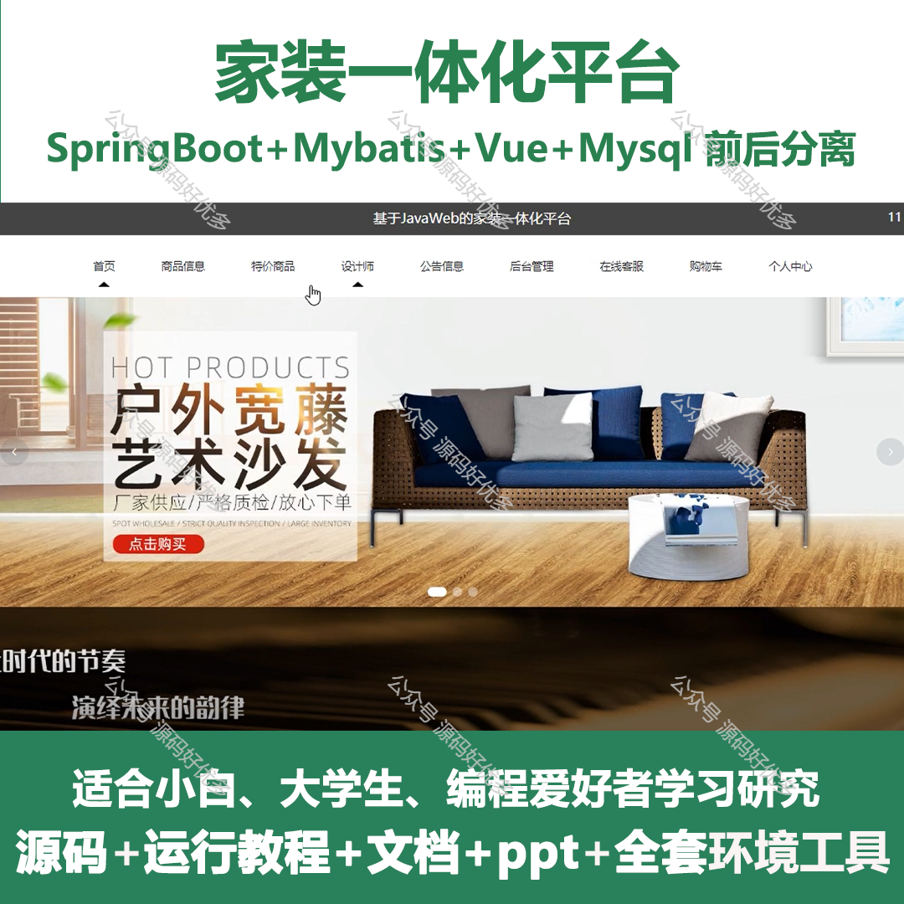
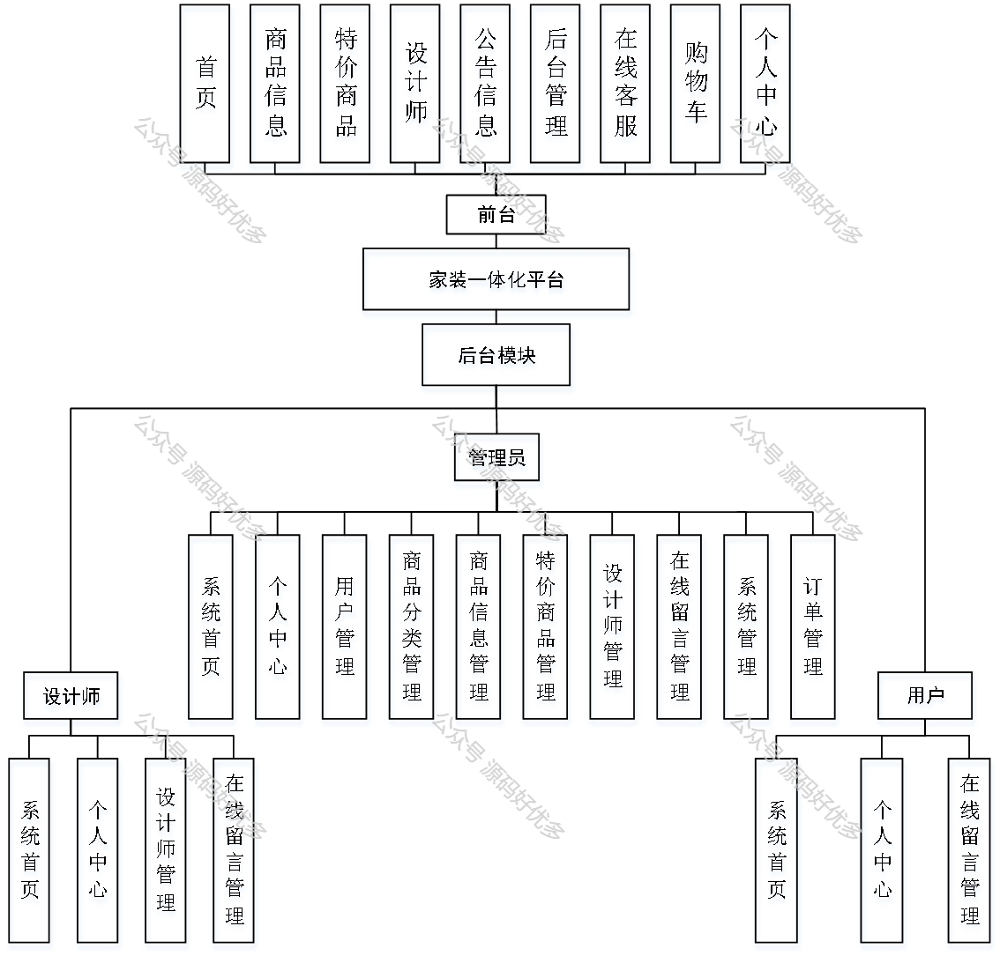
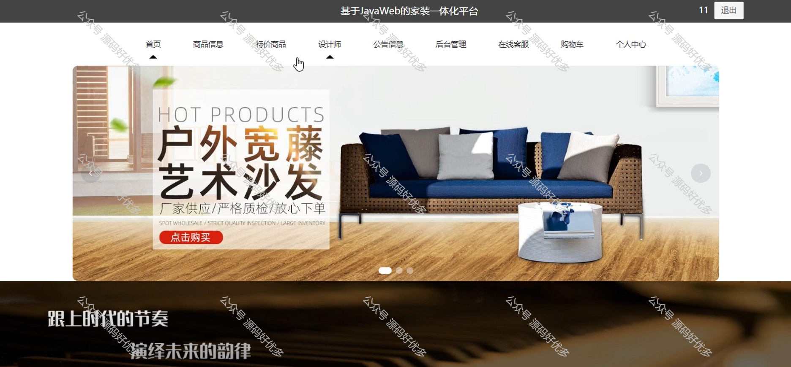
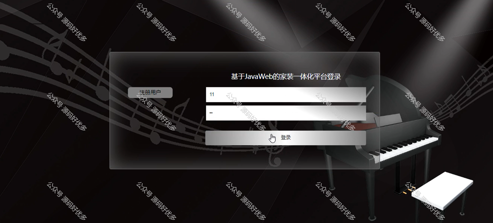
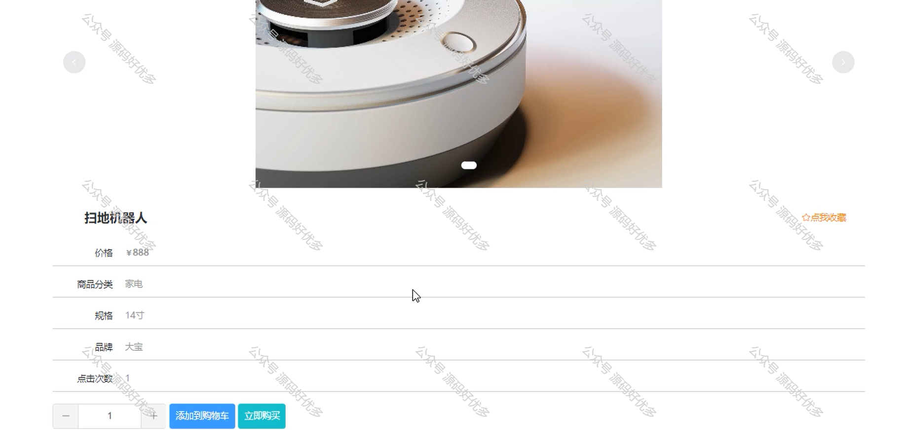
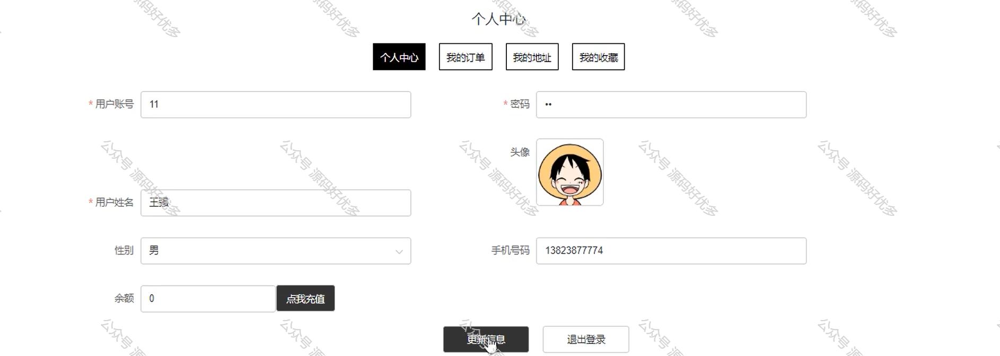
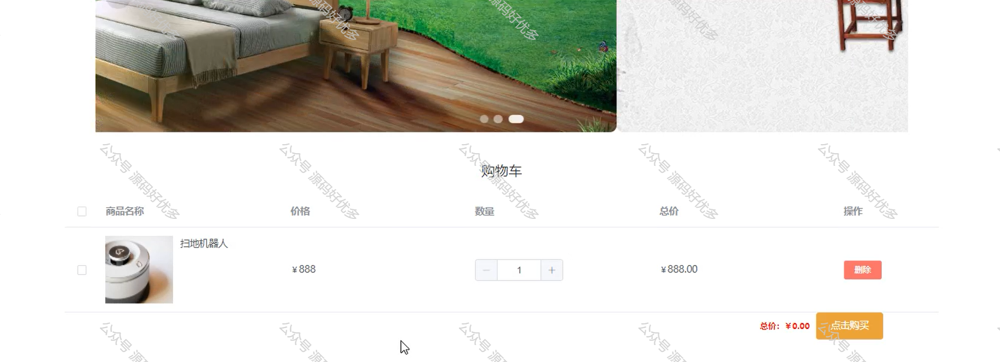
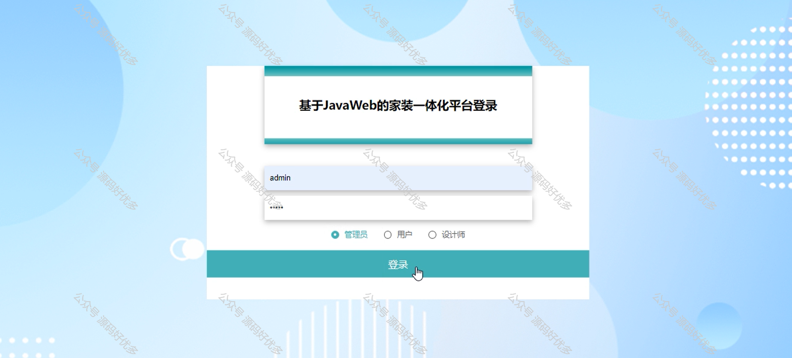
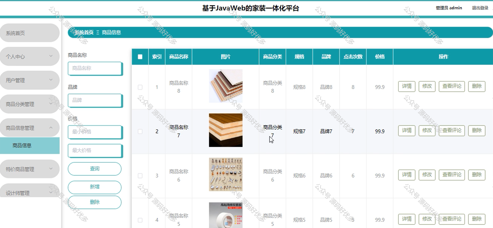
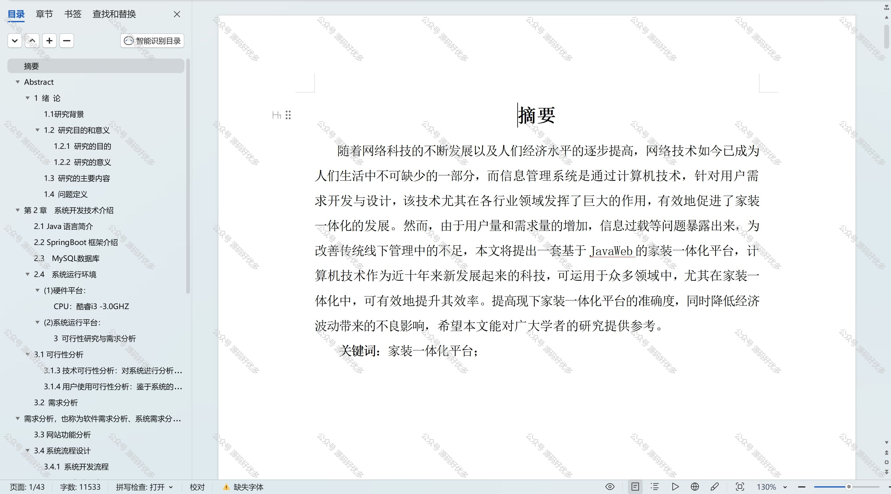

 
## 查看主页获取源码

### 一、作品包含

源码+数据库+设计文档万字+PPT+全套环境和工具资源+部署教程

### 二、项目技术

前端技术：Html、Css、Js、Vue、Element-ui

数据库：MySQL

后端技术：Java、Spring Boot、MyBatis

  

### 三、运行环境

开发工具：IDEA/eclipse

数据库：MySQL5.7

数据库管理工具：Navicat10以上版本

环境配置软件： JDK1.8+Maven3.6.3

前端Nodejs：14

### 四、项目介绍
项目编号：springbootA225

随着人们生活水平的提高和对居住环境要求的增加，家装行业正面临着转型升级的需求。家装一体化平台作为一种新兴的服务模式，为消费者提供了便捷、高效、透明的家装服务。然而，关于家装一体化平台的研究尚处于起步阶段，其运营模式、服务流程、用户体验等方面亟待深入探讨。本文旨在分析家装一体化平台的发展现状、存在的问题，并提出相应的优化策略，以期为家装行业的创新发展提供理论支持和实践指导。

前台用户功能：首页、商品信息、特价商品、设计师、公告信息、后台管理、在线客服、购物车和个人中心。

后台分为管理员、用户、设计师
管理员的功能：系统首页、个人中心、用户管理、商品分类管理、商品信息管理、特价商品管理、设计师管理、在线留言管理、系统管理、订单管理。
用户的功能：系统首页、个人中心、在线留言管理。
设计师的功能：系统首页、个人中心、设计师管理、在线留言管理。

### 五、运行截图

  
